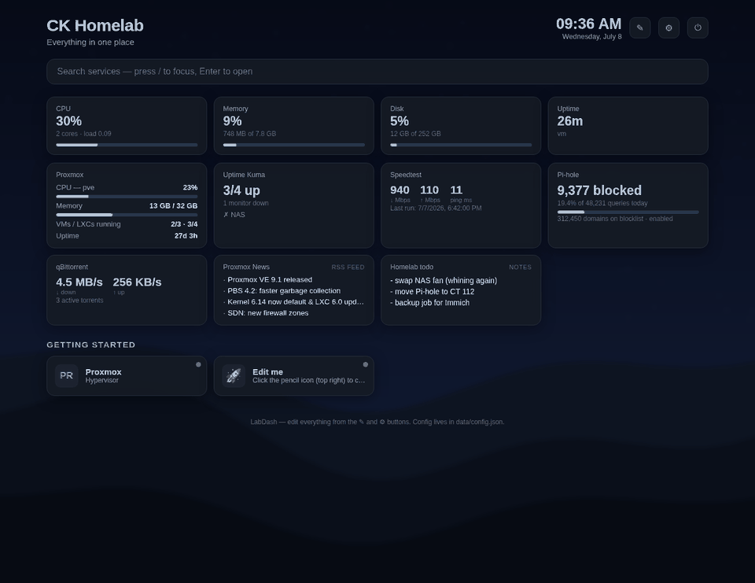

# LabDash

A lightweight, self-hosted homelab dashboard built to live in a Proxmox LXC container.

**Zero runtime dependencies** — plain Node.js, no `npm install`, nothing to build. **Zero code edits** — every service, group, widget, color and setting is changed from the web UI and saved to a single JSON file.

## Features

- **Service tiles** grouped into categories, with icons from [dashboard-icons](https://github.com/homarr-labs/dashboard-icons) (just type `jellyfin`, `pi-hole`, …), emoji, or any image URL
- **Live status checks** — green/red dot per service, tolerant of self-signed certs, any HTTP response (even 401/403) counts as up
- **System stats** — CPU, memory, disk and uptime of the container with severity-colored meters
- **Clock, weather and search** — weather via Open-Meteo (free, no API key), search bar that filters your tiles and falls back to the web
- **Integration widgets** — live cards for **Proxmox** (node CPU/RAM, VM & LXC counts, uptime — via an API token), **Uptime Kuma** (monitors up/down via a status page), **Speedtest Tracker** (latest down/up/ping), **Pi-hole** (queries & blocked today, v5 and v6 APIs), and **qBittorrent** (transfer speeds, active torrents). All fetched server-side, so tokens never reach the browser and there are no CORS headaches.
- **Content widgets** — **RSS/Atom feeds**, sticky **Notes**, and **iframe embeds** (Grafana panels, camera feeds, anything that allows embedding)
- **Custom backgrounds & CSS** — upload a wallpaper straight from your PC (stored on the server, survives updates, no external image host needed), or set an image URL / CSS gradient; blur & dim sliders, frosted-glass cards, plus a custom CSS box — Homarr-style theming without touching code
- **Password protected** — first visit asks you to set a password; sessions survive restarts; change the password anytime from Settings (this signs out every other device); login is rate-limited against guessing
- **Full in-browser editor** — pencil icon toggles edit mode: add/rename/delete groups, add/edit/delete services and widgets, drag tiles between groups; gear icon opens settings (title, dark/light theme, accent color, search engine, widget toggles, weather location, change password)
- **Keyboard friendly** — `/` focuses search, `E` toggles edit mode, `Enter` opens the first match



## Install on Proxmox (helper script)

On the **Proxmox host** shell, as root:

```bash
bash -c "$(curl -fsSL https://raw.githubusercontent.com/ckeeley97/labdash/main/proxmox/labdash.sh)"
```

The script creates an unprivileged Debian 12 LXC (1 core, 512 MB RAM, 4 GB disk, DHCP by default), installs Node.js, clones your repo to `/opt/labdash`, sets up a hardened systemd service, and prints the URL when done — `http://<container-ip>:7380`.

Every default can be overridden:

```bash
CTID=150 CT_HOSTNAME=dash DISK=6 RAM=1024 CORES=2 PORT=8080 \
NET="192.168.1.50/24,gw=192.168.1.1" \
REPO_URL=https://github.com/you/labdash.git \
bash labdash.sh
```

## Updating

Your config is never touched by updates — it lives in `data/config.json`, which is gitignored.

```bash
# from the Proxmox host:
pct exec <CTID> -- bash /opt/labdash/scripts/update.sh
```

## Manual install (any Debian/Ubuntu box or existing LXC)

```bash
apt install -y git nodejs        # Node 18+ required
git clone https://github.com/ckeeley97/labdash.git /opt/labdash
node /opt/labdash/server.js      # → http://<ip>:7380
```

For a permanent setup, copy the systemd unit from `proxmox/labdash.sh` (the `labdash.service` heredoc) or run the helper script.

## Configuration

Everything is edited from the UI, but it all lands in one human-readable file if you ever want to hand-edit, template, or back it up:

```
data/config.json       # your live config (auto-created on first run)
data/config.json.bak   # automatic backup of the previous version
config.default.json    # the shipped defaults
```

Environment variables: `PORT` (default `7380`), `HOST` (default `0.0.0.0`), `DATA_DIR` (default `./data`).

## Widgets

Add widgets in edit mode (✎ → **+ Add widget**):

| Widget | What you need |
|---|---|
| **Proxmox node** | An API token: Datacenter → Permissions → API Tokens. Untick *Privilege Separation*, or grant the token the `PVEAuditor` role on `/`. Enter the token as ID (`root@pam!labdash`) + secret. |
| **Uptime Kuma** | A status page: ☰ → Status Pages → add your monitors. The widget takes your Kuma URL and the page's slug. |
| **Speedtest Tracker** | The app URL and an API token (Settings → API Tokens). Older versions work without a token. |
| **Pi-hole** | v5: the API token from Settings → API. v6: an app password. The widget auto-detects which API answers. |
| **qBittorrent** | Web UI URL + username/password. If login fails, check Options → Web UI (host allowlist / CSRF). |
| **RSS feed** | Any RSS or Atom feed URL. |
| **Notes / Embed** | No setup — notes store text in your config; embed shows any page that allows iframes. |

Widget data is fetched by the LabDash server (60 s cache) — tokens stay server-side and self-signed certs are accepted.

## Password & sessions

- First visit shows a **set password** screen; after that it's a normal login.
- Change the password in ⚙ Settings → *Change password* — all other sessions are signed out.
- Login is rate-limited: 5 wrong tries locks that IP out for a minute.
- **Forgot it?** Delete `data/auth.json` inside the container and restart (`systemctl restart labdash`) — the next visitor sets a new password, so do it promptly.
- Auth data (scrypt hash + session ids) lives in `data/auth.json`, never in git.

## Notes

- Auth is single-user and cookie-based over plain HTTP — fine for a trusted LAN, but put it behind a reverse proxy with HTTPS if you expose it to the internet.
- Status checks run server-side every 15 s (cached), so the dashboard works from any device on your network.
- Weather needs a location: gear icon → Weather location → search a city → Save.

## License

MIT
